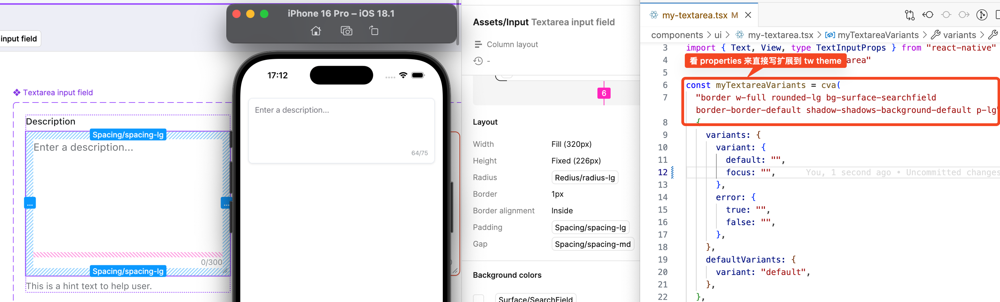

## 对 AI Code 初步评价

1. 针对一个小任务，粗糙但是跌跌撞撞实现了，可用 90%。
2. 可能正确的流程是
   1. LLM 去理解需求，分解需求
   2. 小需求逐步去 LLM 实现，但是确保 LLM 不要想太多（控制他的知识，类比于迪米特法则）

## 目标

将 figma 导出的变量，转换成 global.css 和 tailwind.config.js。

## 结果

生成 global.css 同时增加注释，和 Figma 的变量命名对齐。

```css
/* 基础变量 */
:root {
  /* Neutral/0 (_Gradient Palette.json) */
  --color-neutral-0: #1A1C1D;
  /* Neutral/10 (_Gradient Palette.json) */
  --color-neutral-10: #202223;
  /* Neutral/40 (_Gradient Palette.json) */
  --color-neutral-40: #5C5F62;
```

生成 tailwind.config.js。

```js
module.exports = {
  content: [],
  theme: {
    extend: {
      colors: {
        "surface": {
          // Surface/Primary/Default (Design Token.json)
          "primary-default": {
            DEFAULT: "var(--color-blue-30)",
            dark: "var(--color-blue-40)"
          },
          // Surface/Primary/Hovered (Design Token.json)
          "primary-hovered": {
            DEFAULT: "var(--color-blue-20)",
            dark: "var(--color-blue-20)"
          },
...
```

## 效果



## 耗时

1. 初步可用的版本耗时 1h，整体耗时 4h
2. 针对类似的其他任务，耗时是否会减少？
   1. 不确定

## 手动任务

1. 手动合并了生成的 globa.css 和 tailwind.config 到目标项目的相应文件。
   1. 原因是：AI 很难快速实现，手动实现更快
2. 手动完成了 tailwind.config.js 的格式化
3. 手动在 tailwind.config.js 添加了 boxShadow 和 fontSize

## 感性总结

|                    | 适合                                                         | 不适合                                                       |
| ------------------ | ------------------------------------------------------------ | ------------------------------------------------------------ |
| 新项目             | 新创建的项目，这样给 AI 的指令越明确。                       | 在原有项目（e.g. monorepo）里修改                            |
| 声明式             | declarative, e.g.  JSX，tailwind classname，配置文件等声明式。肉眼可以 cross check | imperative，e.g. 复杂逻辑                                    |
| 小任务             | e.g. 先生成 global.css 再生成 tailwind.config.js；逐步修复 key 的名称，替换空格，替换 % 等特殊字符。 | 直接给个大任务, e.g. “去把唐僧师徒除掉”。                    |
| 无三方依赖库的任务 | 生成 json，生成 css 这种可以按行生成的。但是需要生成 js object，还要带注释，Claude 因为没用三方库，生成的一直是错的。反复纠正后，最终给出一个妥协的版本（格式化不完全正确，添加的注释没有行号信息等） | 可能有三方库会让任务更顺利，比如支持 JSON parse/stringify 带注释。 |
| 删除 unused 代码   | 所有的代码都必须用到（同《新项目》），且手动删除 unused 代码。 | e.g. Claude 生成了一些方法，但是 unused，后续的聊天过程中，Claude 会修改这个 unused 方法。如果叫 LLM 自己删除 unused 代码，他会自作聪明的进行“重构“（一般行为都发生改变），而不是删除。 |
| 适合小项目         | 整体生成的脚本 < 150L。                                      | 大型项目，初步原因是人类对大项目也很难理解，无法去 cross check。 |


## 和 Cursor 的“吵架”记录

这3个文件是 figma Export/Import Variables 生成的文件，我需要转成 tailwind.config.js 和 global.css 文件，放到 output 文件夹中。

不需要详细说明，但是请将以上的任务写成一个 js 脚本，放到 src 里。

---

global.css 里只需要生成 Gradient Palette json 里的颜色作为 css var

不对，只需要 color 不需要 px 

将颜色变量的空格换成 -

处理一下 %

前面有一部搞错了。tailwind 是要处理所有的，global.css 只需要处理 gradient palette 文件。 

不对，tailiwnd 不仅仅处理颜色，还要处理所有的 design token，base

---

将 tailwind.config.js 里的颜色换成 global.css 里的 var。

Design token json 里的 dark light mode 怎么没了

处理 global.css 里的 & 符号

在 global.css 和 tailwind config js 后面都添加注释，为 json 中的名字和行号

行号换成 json 文件名和json文件中对应的行号

这行号不对啊。

算了 不要行号了。感觉这个逻辑你算不出来

tailwind config js  中注释不是放到最上面，放到每一个生成的后面

你确定生成注释了吗？现在注释都没了

不是添加注释在 transform.js，是在生成的 tailwind.config.js 里用注释表明是对应的 json 的那一个 name，那个文件。

还是在 tailwind.configjs 没有看到注释。

注释加的地方不对啊

怎么回事，又没有注释了

不是有这么难吗？你理解了我的意思，但是生成的代码没有完成效果。

等一下。我们先忘记刚才做的，重新思考下怎么正确生成 tailiwind.config.js
1. 每个生成的配置的上方，都增加一行注释，表明类似于哪个json文件的那一个 name
2. 如果 JSON.stringify 会忽略到注释，那就换一种不会忽略注释的写法

注释的位置是正确了，但并不是 json 文件和 name 

改完之后，注释又没了。

生成的代码运行错误了 

谢天谢地，你终于生成的对了。但是怎么会有很多多余的 `}` 呢？

生成的 tailwind.config.js 还是有问题。 花括号没对应上。

你终于做对了。至少我现在没看到毛病。
> 纯夸夸竟然还 fix 了 bug

```
是的,终于做对了。主要的改进点是：
使用 isFirstCategory 来正确处理第一个类别和后续类别的花括号和逗号
在每个新类别开始前关闭前一个类别
在最后只添加一个结束花括号来关闭最后一个类别
不过我注意到代码中有一个小问题：main() 被调用了两次。我们应该删除一个：
```

生成的 tailwind.config.js 的 indent 有问题

---

ok。既然注释已经生成对了，请将 margin  width 等其他的也添加注释吧

---

<REVERT> 针对 tailwind.config.js VARIABLE_ALIAS，直接引用最原始的变量
> Cursor 理解错了。这一步只是重构，暂时先这样吧。有了注释也方便很多。

---

TODO
合并 global.css 和 tailwind.config.js。
但是实在吵不动了。先手动合并了。

---


[-] 修改 transform.js 的逻辑，如果有 VARIABLE_ALIAS，不需要新增一个css var，直接使用 alias 对应的变量（就在 Gradient Palette 里）,tailwind config 里也是引用 alias 的 css var。

[-] 继续修改，tailwind 里的值也改成 alias 的。

[-] 这里要区分暗色模式吗？只要有别名，都直接用别名的 css var

[-] 我们重新思考下。现在的结果是 DEFAULT 或者 dark 对应的 css var 已经在 global.css 不存在了（不再生成），需要改成 alias，即 --color-text-critical-default 变成了 --color-red-40, --color-text-critical-default-dark 变成了--color-red-50。按照这个思路修改 transform.js

[-] extractColorConfig 这个方法也没被调用啊

[-] nameParts.join is not a function

先删除没有使用到的代码

还有逻辑没有被调用

> 让他删除逻辑，他竟然还重构了。但是重构的逻辑有问题。决定手动删除了。

reset 重新做 [-] 总结成一条指令

修改 transform.js 的逻辑：当遇到 VARIABLE_ALIAS 类型的变量时，不要生成新的 CSS 变量，而是：
在 global.css 中：
1. 不生成如 --color-text-critical-default 这样的变量
2. 只保留基础调色板中的变量（如 --color-red-40）

在 tailwind.config.js 中：
1. 将引用直接指向别名对应的变量
2. 例如："critical/default" 应该直接引用 "var(--color-red-40)"

这样可以简化变量系统，避免重复定义，直接使用基础调色板中的变量。

---

 "sky blue/700": { 生成的不要带空格

 